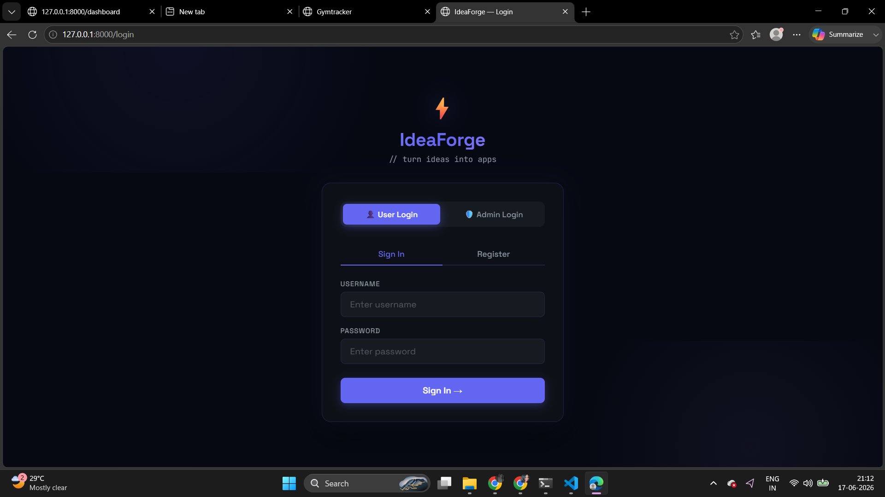
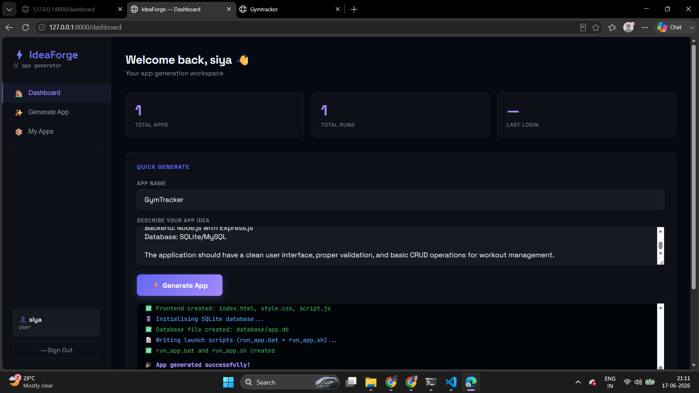
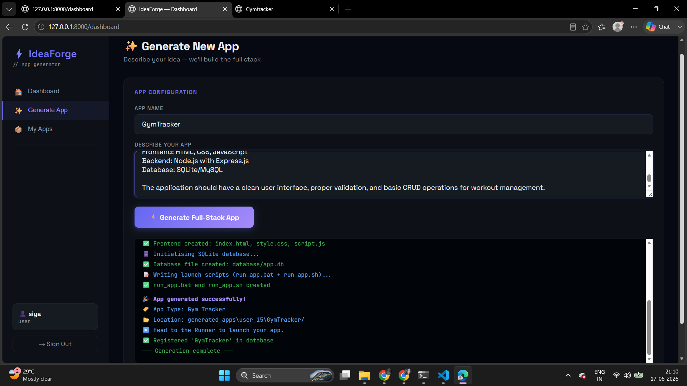
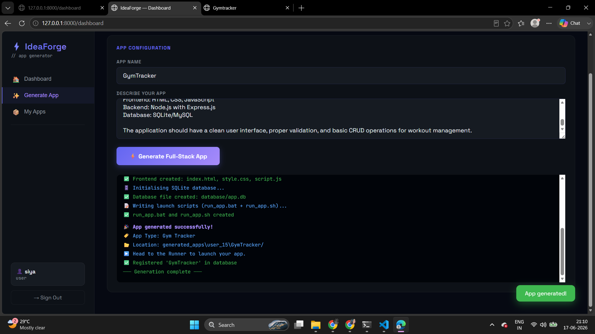
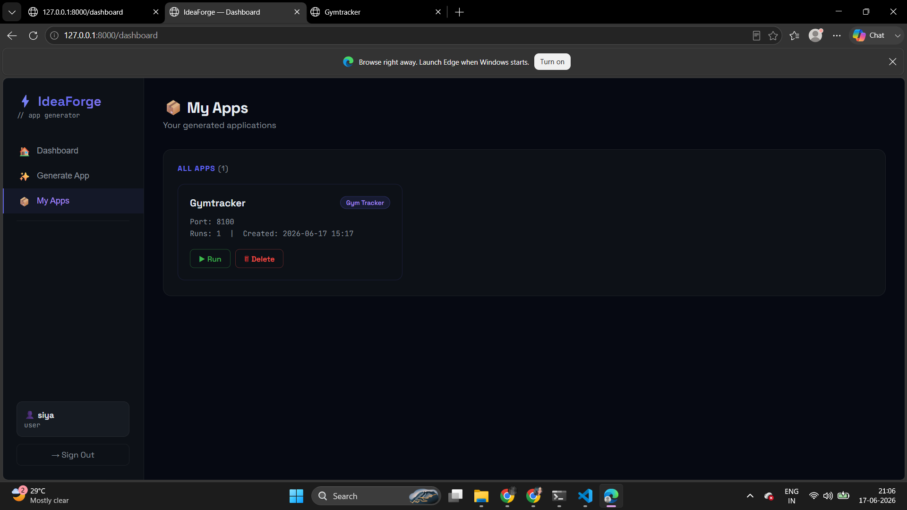
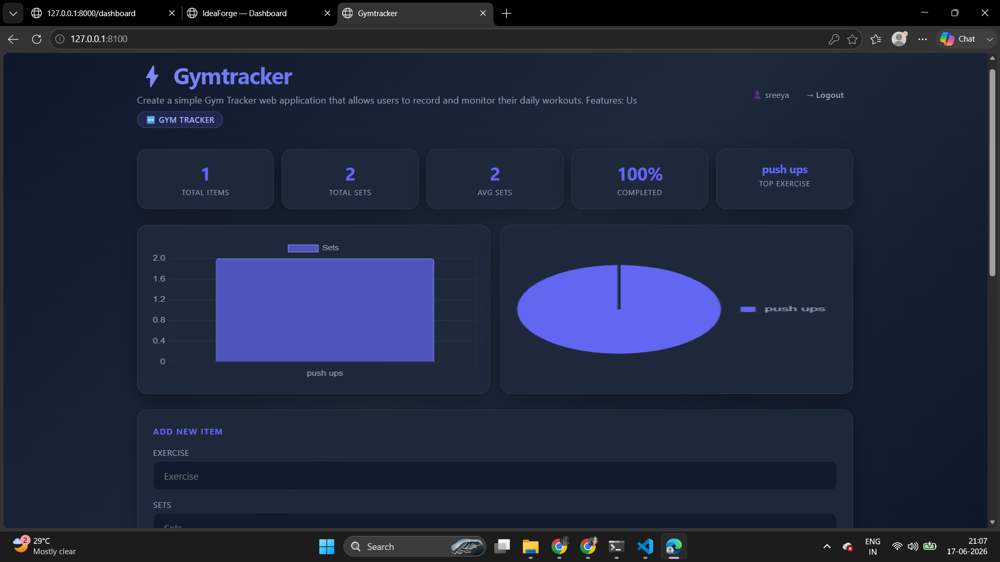
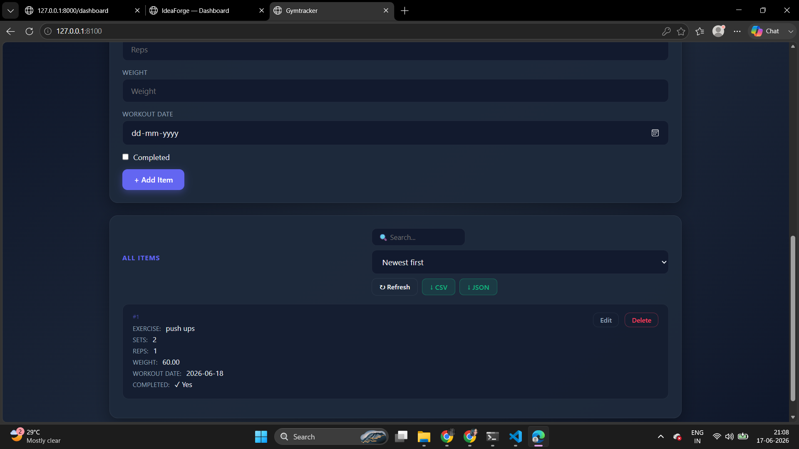

# 🚀 IdeaForge – AI-Powered Full-Stack Application Generator

<div align="center">

### Transform Ideas into Production-Ready Applications in Seconds

Generate complete full-stack web applications from natural language descriptions using automated code generation, FastAPI, SQLAlchemy, and modern web technologies.


</div>

---

## 📌 Overview

IdeaForge is a developer productivity platform that automates the creation of full-stack web applications from simple text descriptions.

Instead of spending hours creating project structures, configuring databases, building APIs, and connecting frontend components, developers can simply describe their application idea and receive a complete, runnable project within seconds.

The platform automatically generates:

* ⚡ FastAPI Backend
* 🗄 SQLAlchemy Database Models
* 🔄 CRUD REST APIs
* 🎨 Responsive Frontend UI
* 📂 Organized Project Structure
* 🚀 One-Click Launch Scripts

---

## 🏆 Highlights

* Built a full-stack application generator using FastAPI and Python
* Automates project scaffolding and boilerplate generation
* Generates complete CRUD-based applications
* Demonstrates backend architecture and code generation concepts
* Designed to accelerate MVP and prototype development
* Reduces development setup time from hours to seconds

---

## ✨ Features

### ⚡ Automated Application Generation

Generate complete full-stack applications from a simple idea.

### 🏗 Backend Generation

* FastAPI REST API generation
* SQLAlchemy ORM integration
* CRUD endpoint generation
* Database initialization
* CORS configuration

### 🎨 Frontend Generation

* Responsive user interface
* Modern dark-themed design
* Dynamic JavaScript integration
* API communication using Fetch API

### 📂 Project Management

* Application Dashboard
* Real-time generation logs
* Generated app explorer
* One-click application launcher

### 🚀 Developer Productivity

* Eliminates repetitive setup work
* Generates runnable projects instantly
* Accelerates development workflows

---

## 🎯 Problem Statement

Developers spend a significant amount of time performing repetitive tasks before implementing actual business logic:

* Creating project structures
* Configuring databases
* Building CRUD APIs
* Connecting frontend and backend
* Writing boilerplate code

IdeaForge automates these tasks and enables developers to focus on solving real-world problems instead of project setup.

---

## 🏛 System Architecture

```text
User Idea
    │
    ▼
┌──────────────────────────┐
│      IdeaForge UI        │
└────────────┬─────────────┘
             │
             ▼
┌──────────────────────────┐
│ Application Generator    │
│ Dynamic Code Builder     │
└────────────┬─────────────┘
             │
             ▼
Generated Application
├── FastAPI Backend
├── SQLAlchemy Models
├── SQLite Database
├── Frontend UI
└── Launch Scripts
```

---

## 📸 Screenshots

### Dashboard


>


```md

```

### Generation Console

> 


```md

```

### Generated Application

> 




```md

```

---

## 🚀 Quick Start

### Requirements

* Python 3.9+
* pip

### Clone Repository

```bash
git clone https://github.com/yourusername/IdeaForge.git

cd IdeaForge
```

### Install Dependencies

```bash
pip install -r requirements.txt
```

### Start IdeaForge

#### Windows

```bash
start.bat
```

#### Linux / macOS

```bash
uvicorn main:app --reload
```

### Open Browser

```text
http://127.0.0.1:8000
```

---

## 🎮 Usage

### Step 1 – Create an Application

Enter:

```text
App Name:
TaskTracker

Description:
Task management system with priorities,
due dates, and status tracking.
```

### Step 2 – Generate

IdeaForge automatically creates:

* Backend APIs
* Database schema
* Frontend interface
* CRUD operations
* Launch scripts

### Step 3 – Run

Launch the generated application directly from the dashboard.

---

## 📁 Project Structure

```text
IdeaForge/
├── main.py
├── app_generator.py
├── app_runner.py
├── database.py
├── requirements.txt
├── start.bat
│
├── templates/
│   ├── dashboard.html
│   ├── console.html
│   └── runner.html
│
├── static/
│   ├── style.css
│   └── script.js
│
└── generated_apps/
    └── {app_name}/
        ├── backend/
        ├── frontend/
        ├── database/
        └── run_app.bat
```

---

## 📦 Generated Application Structure

### Backend

```text
backend/
├── main.py
├── models.py
├── database.py
└── requirements.txt
```

Features:

* FastAPI Server
* CRUD Endpoints
* SQLAlchemy Models
* SQLite Integration
* CORS Support

### Frontend

```text
frontend/
├── index.html
├── style.css
└── script.js
```

Features:

* Interactive UI
* Fetch API Integration
* Responsive Design
* Dark Theme

### Launcher

```text
run_app.bat
```

Automatically:

* Starts Backend Server
* Starts Frontend Server
* Opens Browser

---

## 🛠 Tech Stack

| Layer             | Technology              |
| ----------------- | ----------------------- |
| Backend Framework | FastAPI                 |
| ORM               | SQLAlchemy              |
| Database          | SQLite                  |
| Frontend          | HTML5, CSS3, JavaScript |
| Templates         | Jinja2                  |
| Server            | Uvicorn                 |
| Language          | Python                  |
| Version Control   | Git & GitHub            |

---

## 📊 Engineering Highlights

### Dynamic Code Generation

Built a reusable code generation engine capable of creating complete application structures programmatically.

### Automated Project Scaffolding

Eliminates repetitive setup tasks by generating project boilerplate automatically.

### RESTful API Architecture

Generates backend services following modern API design principles.

### Modular Software Design

Implements separation of concerns across generation, execution, and data management layers.

### Full-Stack Automation

Combines backend, frontend, database, and deployment setup into a unified workflow.

---

## 🔮 Future Roadmap

* React Application Generation
* PostgreSQL Support
* JWT Authentication
* Docker Deployment
* AI-Assisted Schema Design
* Cloud Deployment Integration
* Role-Based Access Control
* Multi-Database Support

---

## 👨‍💻 Developer

### Sreeya Dora

**AI & Machine Learning Engineer | Full-Stack Developer**

Final Year B.Tech Student in Artificial Intelligence & Machine Learning at M. S. Ramaiah University of Applied Sciences.

IdeaForge was built to explore software automation, code generation, backend architecture, and developer productivity tooling. The project demonstrates practical experience in FastAPI, SQLAlchemy, REST API development, database design, and full-stack application engineering.

### Areas of Interest

* Software Engineering
* Artificial Intelligence
* Machine Learning
* Backend Development
* Full-Stack Development
* System Design
* Developer Productivity Tools

### Connect With Me

* LinkedIn: https://www.linkedin.com/in/sreeya-dora
* GitHub: https://github.com/sreeyadora

---

## ⭐ Support

If you found this project useful, consider giving it a star.

It helps others discover the project and motivates future improvements.

**Made with ❤️ by Sreeya Dora**
